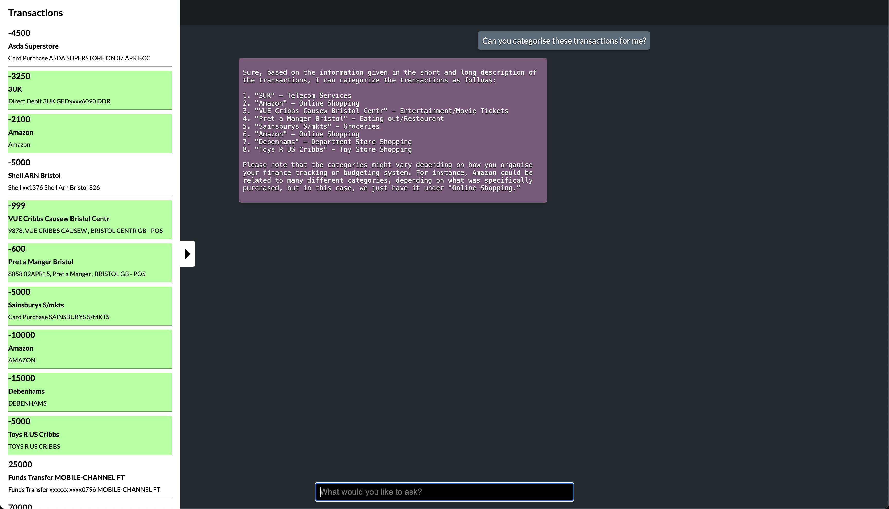

# Moneyhub API + ChatGPT Demo

This application is an example of how ChatGPT (via Credal.ai) can interact with data from the Moneyhub API.



## You will need:

1. A computer running macOS/Linux
2. Node.js >= v16.0.0
3. A Moneyhub Client ID
4. A Moneyhub Client Secret
5. A Credal.AI API key

## Installation
First up, clone this repo to your system, and then `cd` into the `api_and_chatgpt` directory. Next, install the dependencies with `npm install`. Finally, you can start the HTTP server that will accept requests and forward them to GPT-4 via Credal with `npm run start`.

## Credentials

Once you've installed the dependencies, you'll need some credentials to get started: A Credal API key, which you can retrieve by following the instructions [here](../credal-demo/API_KEY.md), and Moneyhub credentials, which you can retrieve by following these steps.

### Obtaining Moneyhub API credentials.

First, head to the [Moneyhub Admin Portal](https://admin-portal.moneyhub.co.uk/) and use SSO with your MH Google credentials.

Once in the portal, click the "API" button on the left-hand side of the screen, then click "All Clients".

In order to create credentials that we can use to interact with the Moneyhub API, we need to create an API Client. Click the "Add New" button, and then fill in the details.

**Make sure the following values are set as such:**

Client Type: sandbox
Redirect URIs: https://redirect.me/?http://localhost:3000

Before saving the configuration, we'll need to create a JWKS pair to include with our API client.

#### Creating a JWKS pair

Go to the [Moneyhub Github repo](https://github.com/moneyhub/moneyhub-api-client) and clone the repository to your local system.

In your terminal, `cd` to the `/examples/jwks` directory of the repo you just cloned. Once there, you can run `node create-jwks.js` to create a public and private key that we can use to authenticate with the Moneyhub API.

Once the keys are generated, save the private key in the `api_and_chatgpt` folder that we cloned earlier in a file called `private_key.pem`. Copy the public key to your clipboard, and paste it in the JWKS input of the "Add API Client" form we were filling in a few moments ago.

Click "Save" to save the configuration of your API Client, then click it from the list to see the details of the API Client we just created.

Take note of the Client ID and Client Secret values. Copy each one and set the CLIENT_ID and CLIENT_SECRET environment variables with the corresponding values.

## Running

Once you've created and set all of the needed credentials, and installed all of the dependencies, you're ready to run the application.

You can do this by running...

```npm run start```

... in the `/api_and_chatgpt` directory. By default, a server will be created and will listen on **port 3000**, but you can change that by setting the `PORT` environment variable.

**Make sure your redirect URI and server are configured for the same port!**

## Environment Variables.

This application uses environment variables to access credentials for the application. You can set environment variables on the system, or if running locally, you can create a `.env` file in the root of your working folder to contain the environment variables you would like your application to use.

The following is an exhaustive list of environment variables that the application uses:

```
DEBUG: Set as * to see all of the applications logging
PORT: The port that you want your HTTP server to listen on. Defaults to 3000
CLIENT_ID: The Moneyhub Client ID from your API Client
CLIENT_SECRET: The Moneyhub Client Secret from your API Client
API_KEY: Your Credal.ai API key.
```