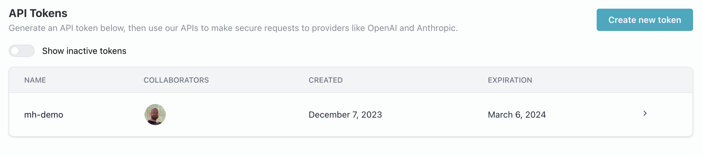
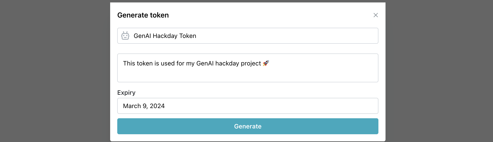
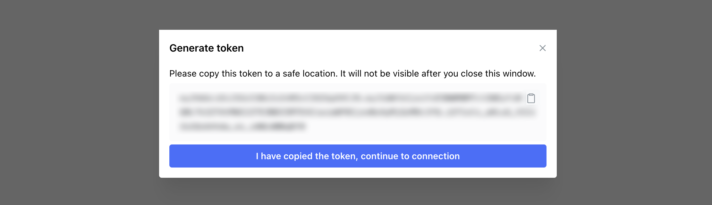

# Obtaining a Credal API Key

To obtain a Credal.ai API key, head to the [API Tokens section](https://app.credal.ai/api-tokens) on the Credal app.

Here, you should see a list of API tokens you've already created, and a button to create a new one.

Click the "Create new token" button to open the token creation dialog.

Once it opens, add a title, description, and expiration date for your token.

Once you click "Create", a token will be displayed on-screen. Copy this to your clipboard and paste it wherever you wish to use it.

